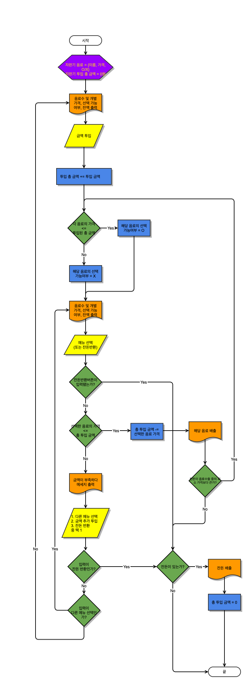

# helloworld
헬로우 월드 입니다 (옵션어라 써도그만 안써도 그만) 
여기는 markdown language를 쓴다. 
나무위키, 위키피디아 
# 개발자 소개
## 작품 1 - django framework 활용 게시판 만들기 
### 설계도

### 발표자료 
[최종 발표자료](/project.pptx)

### 시연 동영상 
<iframe width="1139" height="630" src="https://www.youtube.com/embed/5EtOquxfIRA?list=RD5EtOquxfIRA" title="[최신가요 실시간 인기차트] 2025년 7월 24일 4주차, 멜론차트 X, 종합차트, 노래모음 KPOP 플레이리스트" frameborder="0" allow="accelerometer; autoplay; clipboard-write; encrypted-media; gyroscope; picture-in-picture; web-share" referrerpolicy="strict-origin-when-cross-origin" allowfullscreen></iframe>

### reference
[네이버](https://www.naver.com)
[구글](https://www.google.com)

# 사진
동영상
link생성
list
